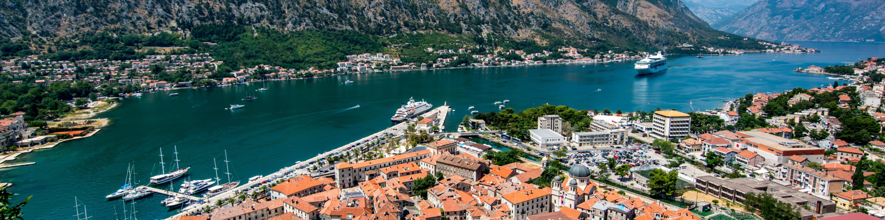

  
  <h1>Hi there, I'm Dmitrii Novikov</h1>
  <h3>Distributed Systems Engineer · Observability Infrastructure · Go & Java</h3>

  

    
    &nbsp;
    
    &nbsp;
    
    &nbsp;
    
  

## Summary

Senior backend engineer, moving from Java/Spring to Go and from generalist backend to **distributed systems and observability**.

At EPAM Systems I work on **OSDU**, a cloud-native data platform in the energy domain — 20+ microservices on Google Cloud, bare Kubernetes, PostgreSQL, and MinIO.

On the side I'm building **[PipeTrace](https://github.com/7nolikov/osdu-ingestion-pipeline)**: a Go async ingestion pipeline (Kafka → validation → MinIO + PostgreSQL) with OpenTelemetry tracing, Prometheus metrics, and structured logging. Load-tested at ~212 req/s, p99 ~ 730 ms.

---

## 🛠 Stack

- **Languages:** Go (active), Java / Spring Boot (production)
- **Distributed systems:** Kafka, gRPC, microservices, event-driven architecture
- **Storage:** PostgreSQL, MinIO / S3
- **Observability:** OpenTelemetry, Prometheus, Grafana, structured logging (slog)
- **Infra:** Kubernetes (bare + GKE), Docker, GitLab CI
- **Background:** 3 years as a QA Engineer — informs how I design for testability and failure modes

  
  
  
  
  
  
  
  

---

## 📜 CV

- [The latest CV](https://7nolikov.github.io/cv/Dmitrii-Novikov-CV.pdf)

## 🌍 Active

- EU Blue Card holder (Croatia). Based in Zagreb from June 2026.
- Writing about distributed systems and observability at [7nolikov.dev](https://7nolikov.dev).

---

  

